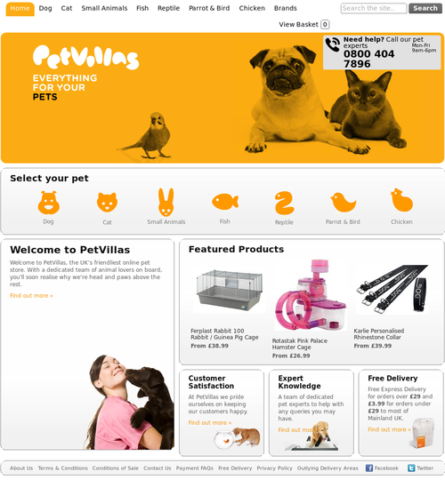
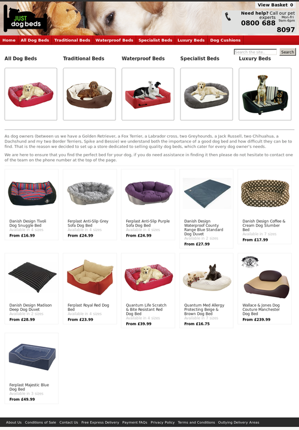
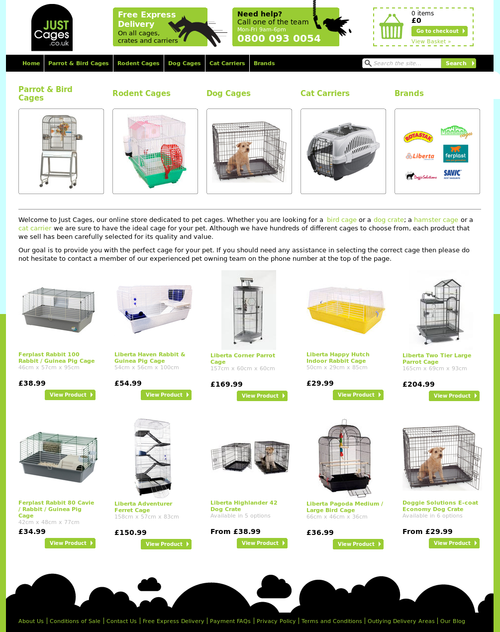

!SLIDE
# If you'd use #
# Rails Engines #
# you'd be home by now #

!SLIDE bullets incremental
# What's an engine? #

* Rails 3 plugin
* Packaged as a gem
* Mounted inside of a rails app
* Self-contained functionality

!SLIDE smbullets incremental
# Should I use engines? #

* Do you use rails?
* Do you have similar/shared functionality in multiple apps?
* Do you create new rails apps often?
* Have you ever wanted to version just part of your app?
* Are you webscale?

!SLIDE smbullets incremental
# Speed up developmet #

* bolt on a blog
* add a cms
* Login with devise
* bring in a contact form
* sell out with spree

!SLIDE
# Focus on the core #
# Bolt on the rest #

!SLIDE
# Example #

!SLIDE
# Outlet #

!SLIDE center

!SLIDE

# Code extracted from Petvillas

!SLIDE smbullets

# Used for the "Just" sites #

* Products & Variants
* Catalogs
* Stock levels
* Basket
* Syncing and management

!SLIDE center

!SLIDE smbullets

# Easy per-site customisation #

* Simple experiments
* Different designs
* Even different databases*

*arbitrary mongodb reference

!SLIDE

!SLIDE

# Quickly produce new shops #

!SLIDE center

!SLIDE smbullets incremental
# What can you do with an engine? #

* app directory
* migrations
* assets
* routes
* locals
* generators
* initializers
* easily to override

!SLIDE

    outlet/app/models
    outlet/app/controllers
    outlet/app/views
    outlet/config/routes.rb
    outlet/lib/outlet.rb
    outlet/lib/tasks
    outlet/outlet.gemspec

!SLIDE code ruby
    @@@ruby
    # outlet.rb
    module Outlet
      class Engine < Rails::Engine

      end
    end

!SLIDE small
# Webscale tip #
## Generate css directly from you engine ##

!SLIDE small
# 1. Add to outlet.rb #

    @@@ruby
    SASS_PATH = File.join(File.dirname(__FILE__),
                  *%w[.. .. sass])
    CSS_PATH = File.expand_path(File.join(Rails.root,
                  %w[public stylesheets]))
    ::Sass::Plugin.add_template_location(SASS_PATH, CSS_PATH)

!SLIDE small
# 2. Add sass files to #
    outlet/sass
    outlet/sass/application.sass
    outlet/sass/roflscale.sass

!SLIDE center
# 3. Profit! #

!SLIDE smbullets
# Rails 3.1 #

* Mountable engines
* Isolate namespaces
* easier to mixin functionality

!SLIDE center
## git clone git://github.com/andrew/engines.git ##
powered by showoff & heroku