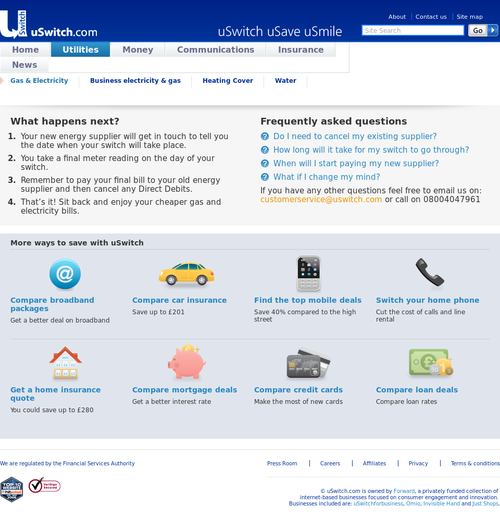

!SLIDE
# If you'd use #
# Rails Engines #
# you'd be home by now #

!SLIDE bullets incremental
# What? #

* a distinct piece of functionality
* packaged as a gem
* mounted inside of a rails app
* rails 3

!SLIDE smbullets incremental
# Speed up developmet #

* bolt on a blog
* add a cms
* Login with devise
* bring in a contact form
* sell out with spree

!SLIDE
# Focus on the core #
# Bolt on the rest #

!SLIDE smbullets incremental
# Should I use engines? #

* Do you use rails?
* Do you have similar/shared functionality in multiple apps?
* Do you create new rails apps often?
* Have you ever wanted to version just part of your app?

!SLIDE
# Example #

!SLIDE
# Outlet #

!SLIDE center

!SLIDE

# Code extracted from Petvillas

!SLIDE smbullets

# Used for the "Just" sites #

* Products
* Catalogs
* Stock levels
* Basket
* Syncing and management

!SLIDE center

!SLIDE smbullets

# Easy customisation #

* Simple experiments
* Different designs
* Even different databases

!SLIDE center

!SLIDE

# Quickly produce new shops #

!SLIDE center

!SLIDE smbullets incremental
# What can you do with an engine? #

* app directory
* migrations
* assets
* routes
* locals
* generators
* initializers
* easy to override

!SLIDE
# Code #

!SLIDE
# Rails 3.1 #

## New engine functionality coming in rails 3.1 ##
